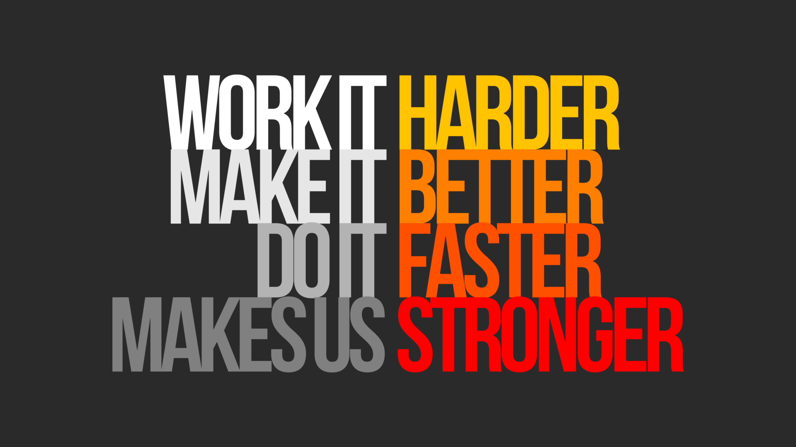
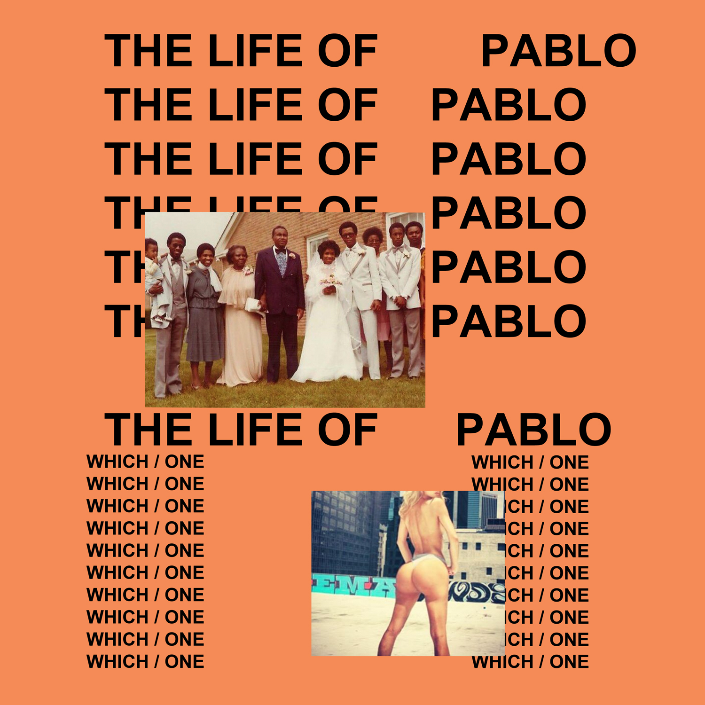
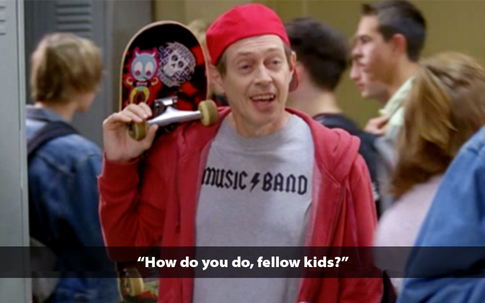

<!-- _footer: "" -->

#### How I Learned to Stop Worrying and love

# Feedback Loops

[FeedbackLoops.SeanKilleen.com](https://FeedbackLoops.SeanKilleen.com)

---

## What We'll Cover

- What are feedback loops
- Why they matter
- Feedback loop journeys

---

<!-- _footer: "" -->

# <!--fit--> Hi! :wave: I'm Sean

- :bird: [sjkilleen](https://twitter.com/sjkilleen)
- :earth_americas: [SeanKilleen.com](https://seankilleen.com)
- :briefcase: [Excella](https://excella.com)

---

# What are feedback loops?

---
<!-- _footer: "" -->

---

#### Feedback Loop Components

# 1. Evidence

---

#### Feedback Loop Components

# 2. Context / Relevance

---

#### Feedback Loop Components

# 3. Consequence

---

#### Feedback Loop Components

# 4. Action

---

---
<!-- _footer: "" -->

---
<!-- _footer: "" -->

---

---
<!-- _footer: "" -->

---

# Why feedback loops?

---

#### Why feedback loops?

# Opportunities

---

#### Why feedback loops?

# Pattern Recognition

---

#### Why feedback loops?

# The Tipping Point

---

# Feedback Loop Journies

---

# Journey: code

## Enable Quality

<!-- TODO: Infinite loop image? -->

---

#### Journey: code

# Bug Reports

---

#### Journey: code

# Manual Release Testing

---

#### Journey: code

# Continuous Integration

(Nightly)

---

#### Journey: code

# Automated Acceptance

---

#### Journey: code

# Integration Tests

---

#### Journey: code

# CI (Every Change)

---

#### Journey: code

# Unit Tests

---

#### Journey: code

# Continuous Testing

---

#### Journey: code

# TDD

---

# Journey: Delivery

## Enable Value

<!-- TODO: Easy button? $? -->

---

#### Journey: Delivery

# Yearly Release

---

#### Journey: Delivery

# Quarterly Release

---

#### Journey: Delivery

# Per Sprint

---

#### Journey: Delivery

# Nightly

---

#### Journey: Delivery

# Continuous

---

# Journey: Infrastructure

## Enable Architecture

<!-- TODO: Circular building? -->

---

#### Journey: Infrastructure

# Provisioning Servers

---

#### Journey: Infrastructure

# Virtual Machines

---

#### Journey: Infrastructure

# Containers

---

#### Journey: Infrastructure

# Infrastructure as Code

---

# Journey: Marketing

## Enable Reach

<!-- TODO: Globe? -->

---

#### Journey: Marketing

# Yearly Survey

---

#### Journey: Marketing

# Survey pop-ups

---

#### Journey: Marketing

# Analytics

---

#### Journey: Marketing

# A/B Testing

---

# Journey: Process

## Enable adaptation

<!-- TODO: Circle of life? Circulator evolution? -->

---

#### Journey: Process

# Waterfall

---

#### Journey: Process

# Scrum

---

#### Journey: Process

# Kanban

---

#### Journey: Process

# Experiments

---

# Journey: Interactions

## Enable Collaboration

<!-- TODO: Friends circle-->

---

#### Journey: Interactions

# Release Retro

---

#### Journey: Interactions

# Sprint Retro

---

#### Journey: Interactions

# Standup

---

#### Journey: Interactions

# Pair Programming

---

#### Journey: Interactions

# Mood Boards

---

#### Journey: Interactions

# Mobbing

---

# Journey: OSS

## Enable Contribution

<!-- TODO: Image? -->

---

#### Journey: OSS

# Isolation

---

#### Journey: OSS

# Copy

---

#### Journey: OSS

# Fork

---

#### Journey: OSS

# Pull Request

---

#### Journey: OSS

# WIP Pull Request

---

#### Journey: OSS

# Issue

---

# Journey: You as a Professional

## Enable Growth

---

#### Journey: You as a Professional

# Yearly Review

---

#### Journey: You as a Professional

# Bi-Weekly Check-in

---

#### Journey: You as a Professional

# Seeking Feedback

---

#### Journey: You as a Professional

# Telegraphing Intention

---

# Journey: Career

## Enable Happiness

---

#### Journey: Career

# Major Career Shift

---

#### Journey: Career

# Job Boards

---

#### Journey: Career

# Building Relationships

---

#### Journey: Career

# Experiential Learning

---
<!-- _footer: "" -->

---

# Fast vs. Broad

## Diversity &amp; Inclusion Matter

---
<!-- _footer: "" -->

---
<!-- _footer: "" -->

---
<!-- _footer: "" -->

---

<!-- _footer: "" -->

# <!--fit--> Thanks

- :bird: [sjkilleen](https://twitter.com/sjkilleen)
- :earth_americas: [SeanKilleen.com](https://seankilleen.com)
- :briefcase: [Excella](https://excella.com)
